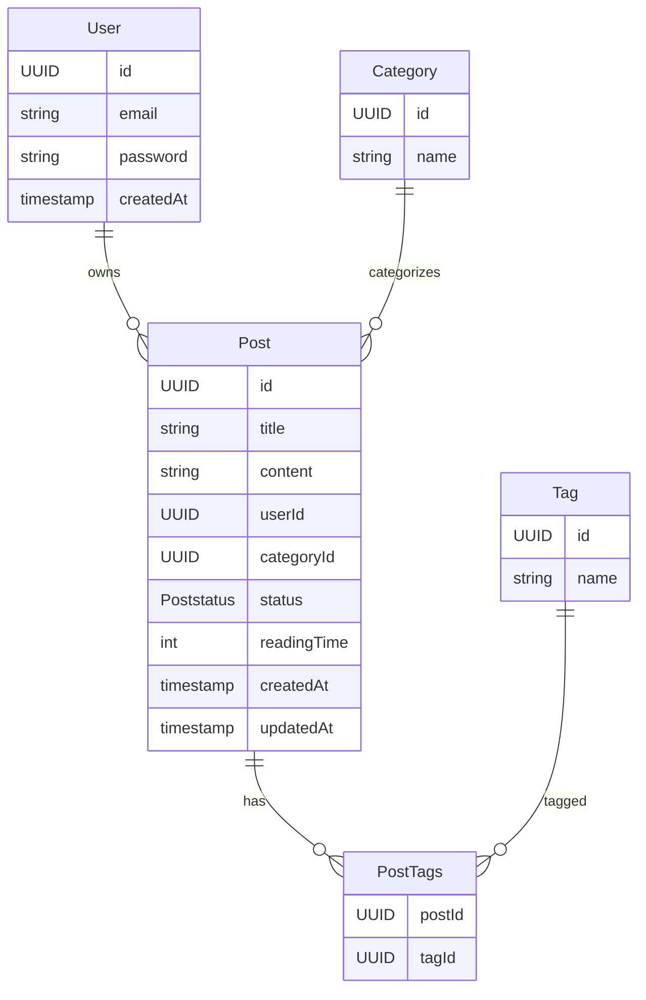

# Blog Platform

## Overview

A web app for creating, managing, and publishing blog posts with reader engagement features.

## Features

- Rich text editor with formatting options
- Categorization and tagging
- Draft management with previews

## Extras

- Comments with timestamps and basic formatting
- Full-text search, filtering, sorting
- SEO metadata, RSS feed, archive view

## Tech Stack

- Frontend: React.js
- Backend: Java Spring Boot
- Database: PostgreSQL
- Authentication: Spring Security & JWT
- Styling: Tailwind CSS
- Deployment: Vercel / Docker

## Data Model

## Enumerations

### PostStatus
Defines the status of a blog post:
- `DRAFT`
- `PUBLISHED`

